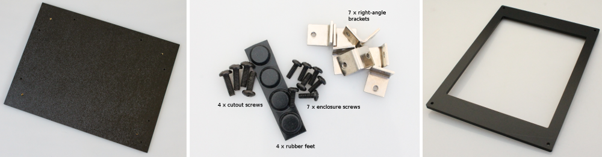
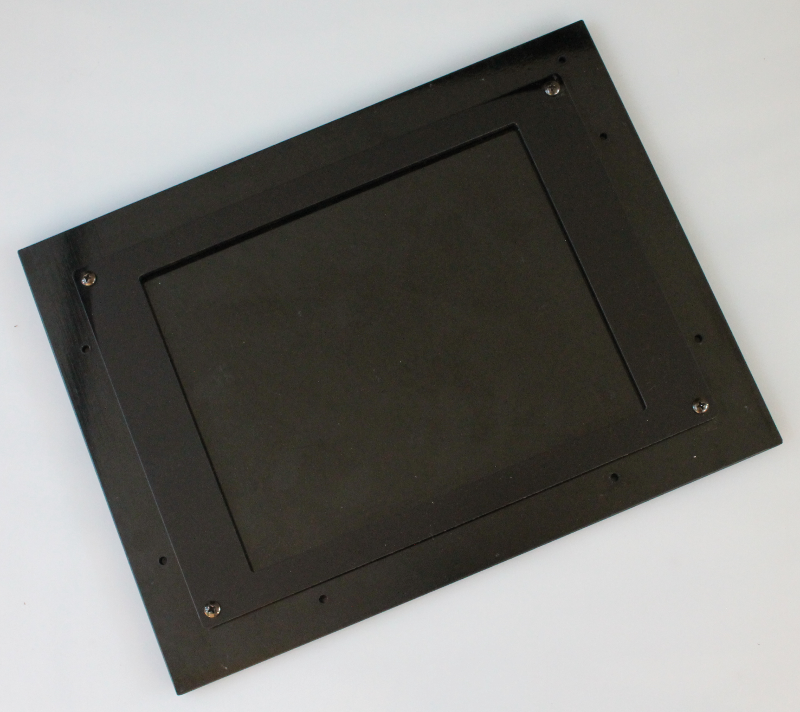
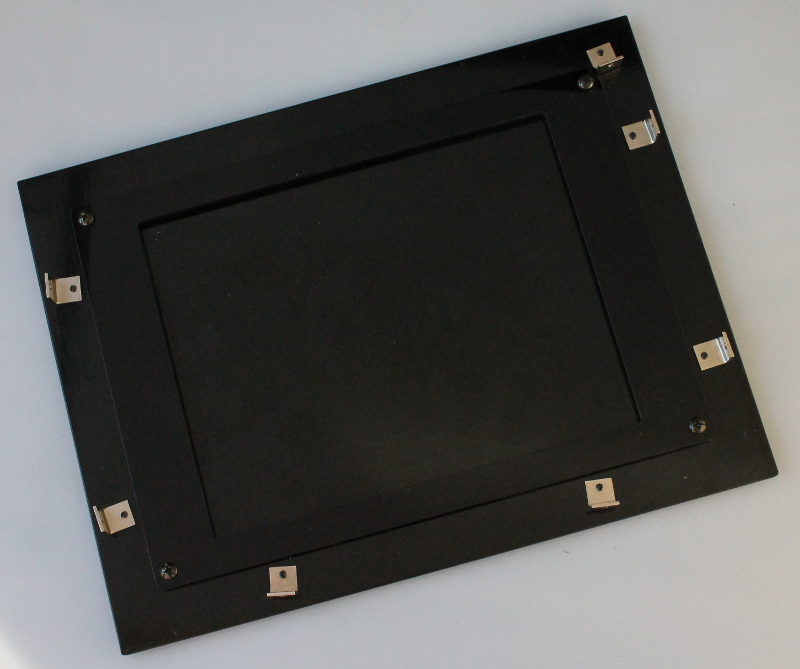

Step 1: Base Panel
=====================================

Parts
---------------

#. Base Panel
#. Hardware bag 1
#. Insert frame for transilluminator (large version is shown)

Assembly steps
-----------------

Attach rubber feet to the base panel
^^^^^^^^^^^^^^^^^^^^^^^^^^^^^^^^^^^^^^^^^^^^

.. figure:: _static/rubber_feet.png
   :align:  center

With the 4 screws, attach the insert frame to the base panel
^^^^^^^^^^^^^^^^^^^^^^^^^^^^^^^^^^^^^^^^^^^^^^^^^^^^^^^^^^^^^^^^^^

On the base plate mount 7 of the right-angle brackets
^^^^^^^^^^^^^^^^^^^^^^^^^^^^^^^^^^^^^^^^^^^^^^^^^^^^^^^^^^^^^^^^^^^^^^^^^^^^^^^^^^^

