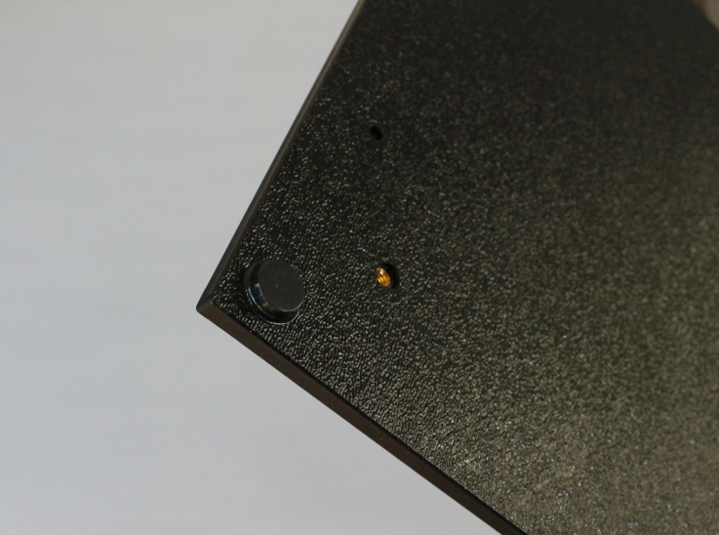

**Assembly instructions start here !** 

Step 1: Base Panel
=====================================

Parts
---------------

.. figure:: _static/base_panel_parts.png
   :align:  center

#. Base Panel
#. Hardware bag 1
#. Insert frame for transilluminator (large version is shown)

Assembly steps
-----------------

Attach rubber feet to the base panel
^^^^^^^^^^^^^^^^^^^^^^^^^^^^^^^^^^^^^^^^^^^^

Attach the transilluminator frame to the base panel
^^^^^^^^^^^^^^^^^^^^^^^^^^^^^^^^^^^^^^^^^^^^^^^^^^^^^^^^^^^^^^^^^^
Peel off the paper-backing on the frame and screw into the base panel using the 4 longer insert frame screws.

.. figure:: _static/base_assembly_1.png
   :align:  center

Mount 7 right-angle brackets
^^^^^^^^^^^^^^^^^^^^^^^^^^^^^^^^^^^^^^^^^^^^^^^^^^^^^^^^^^^^^^^^^^^^^^^^^^^^^^^^^^^

Using the screwdriver and enclosure screws, place the right angle brackets as shown in the images below. The brackets do not need to be tightened down too much at this point as you may have to adjust them later. 

.. figure:: _static/will_base_0.png
   :align:  center

.. figure:: _static/base_assembly_2b.png
   :align:  center
