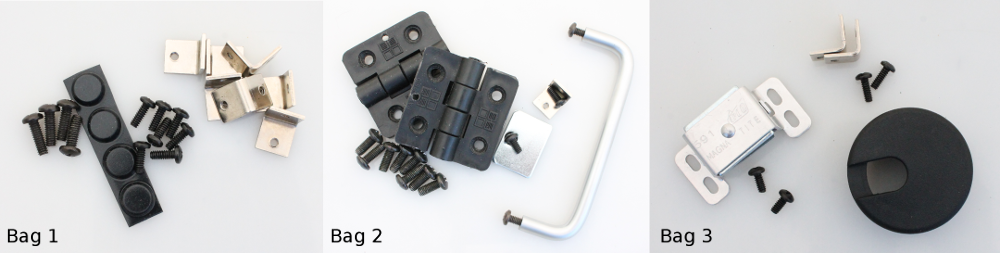

Hardware
=====================================

To make assembly steps easier, the hardware is broken up into 6 bags (Hardware Bags 1-6).

.. figure:: _static/bags_4_5_6.png
   :align:  center

Bag 1 - Base panel
----------------------------

=====   =======================================   =======================================            
Qty     Description                               Screw reference [#f1]_
=====   =======================================   =======================================           
7       6-32, 3/8” long screws                    Enclosure screws                 
4       8-32, 1/2” long screws                    Insert frame screws                   
7       Right-angle brackets                     
4       Rubber feet                               
=====   =======================================   =======================================     

Bag 2 - Door panel
----------------------------

=====   =======================================   =======================================            
Qty     Description                               Screw reference
=====   =======================================   =======================================           
1       6-32, 3/8” long screws                    Enclosure screws                 
1       8-32, 5/16” long screws                   Magnet plate screw                  
2       8-32, 1/2” long screws                    Door Handle                    
8       10-32, 1/2” long screws                   Hinge screws                 
1       Handle                                   
2       Hinges                                   
1       Magnet latch plate                             
1       Right-angle brackets                     
=====   =======================================   =======================================     

Bag 3 - Right panel
----------------------------

=====   =======================================   =======================================            
Qty     Description                               Screw reference 
=====   =======================================   =======================================           
2       6-32, 3/8” long screws                    Enclosure screws                 
2       6-32, 5/16” long screws                   Magnetic latch screws               
1       Magnet latch                             
1       Cable grommet                            
2       Right-angle brackets                     
=====   =======================================   =======================================     

Bag 4 - Left and Back panels
-------------------------------

=====   =======================================   =======================================            
Qty     Description                               Screw reference 
=====   =======================================   =======================================           
9       6-32, 3/8” long screws                    Enclosure screws                 
9       Right-angle brackets                     
=====   =======================================   =======================================     

Bag 5 - Top panel
----------------------------

=====   =======================================   =======================================            
Qty     Description                               Screw reference 
=====   =======================================   =======================================           
4       6-32, 3/8” long thumbscrew                Filter standoff thumbscrews                
4       6-32, 1/2” long male-female standoffs    
=====   =======================================   =======================================     

Bag 6 - Enclosure Assembly
----------------------------

=====   =======================================   =======================================            
Qty     Description                               Screw reference
=====   =======================================   =======================================           
19      6-32, 3/8” long screws                    Enclosure screws                 
=====   =======================================   =======================================     

.. rubric:: Footnotes

.. [#f1] In the assembly instructions, the screws are referred to by their use in that assembly step, rather than thread size and length. For example an **enclosure screw** instead of **6-32, 3/8" long screw**.  
