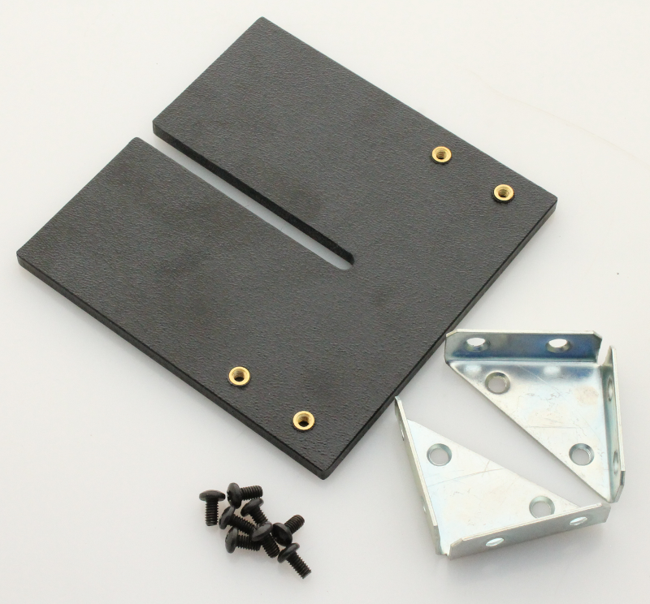

Additional hardware for camera mounting
=============================================

The following hardware is used only for the camera mounting top and is not required for the Smartphone version.

=====   =======================================   ===================   ===================            
Qty     Description                               Vendor                Part #
=====   =======================================   ===================   ===================          
2       Right-angle brackets                      McMaster-Carr         1088A31
8       8-32, 5/16” long screws                   McMaster-Carr         91249A190
1       1/4" thick ABS camera mount               --                    --
1       Camera mount thumb screw (not shown)      McMaster-Carr         91185A803
=====   =======================================   ===================   ===================          

