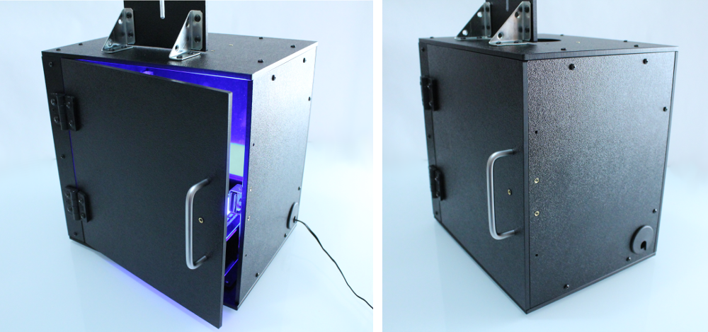

.. Imaging Enclosure documentation master file, created by
   sphinx-quickstart on Tue Aug 25 14:09:54 2015.
   You can adapt this file completely to your liking, but it should at least
   contain the root `toctree` directive.

   
This is the documentation and Build Instructions for our Imaging Enclosure kit. This kit can be purchased from our online store at http://www.iorodeo.com.
The imaging enclosure is a 12" x 9" wide x 12" tall box made from machined 0.25" thick machined ABS. 
   
   
   
   
   

   
Table of Contents
=============================================

Kit Contents
^^^^^^^^^^^^^^^^^^^^^^

.. toctree::
   :maxdepth: 1

   kit_contents.rst
   acrylic_frames.rst
   hardware.rst
   hardware_camera.rst

Assembly Instructions
^^^^^^^^^^^^^^^^^^^^^^^^^^^^^^^^^^^^^^^

.. toctree::
   :maxdepth: 1

   base_panel.rst
   door_panel.rst
   right_panel.rst
   left_back_panel.rst
   smartphone_top.rst
   top_panel.rst
   assembly_2.rst
   assembly_3.rst
  

   
Using the imaging enclosure
^^^^^^^^^^^^^^^^^^^^^^^^^^^^^^^^^^^^^^^^^^^^^^^^^^^^^

.. toctree::
   :maxdepth: 1

   transilluminator.rst
   gel_images.rst

   
Additional info
^^^^^^^^^^^^^^^^^^^^^^^^^^
This is an open source hardware project licensed under the `Creative Commons Attribution 3.0 License <http://creativecommons.org/licenses/by/3.0>`_. 

Designs for machining the enclosure can be found online at https://bitbucket.org/iorodeo/gel_imaging_enclosure

.. toctree::
   :maxdepth: 2

   hardware_list.rst

   
   
Search
-------------------

* :ref:`search`

   
