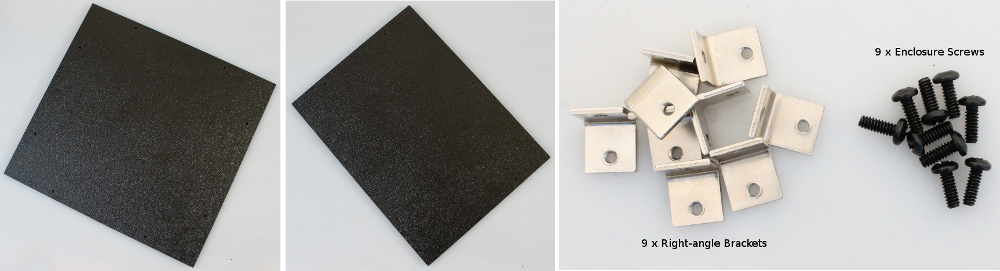
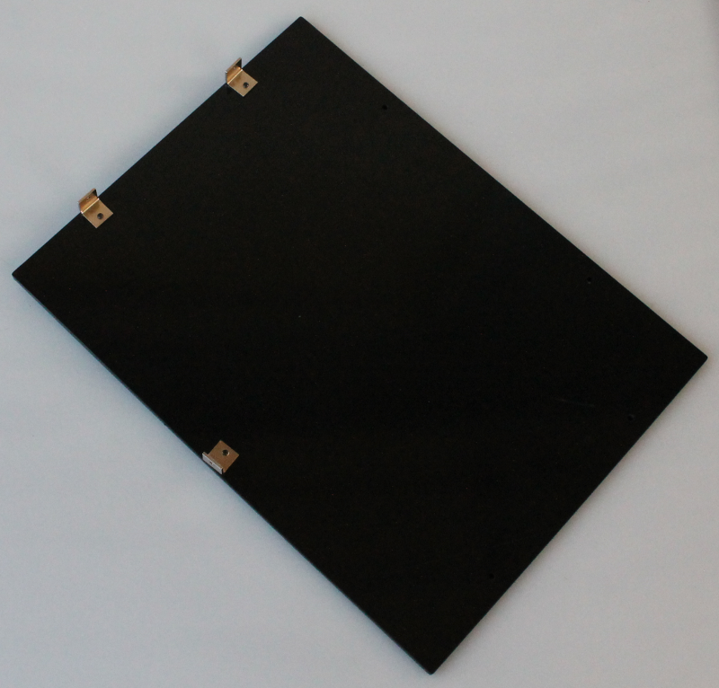
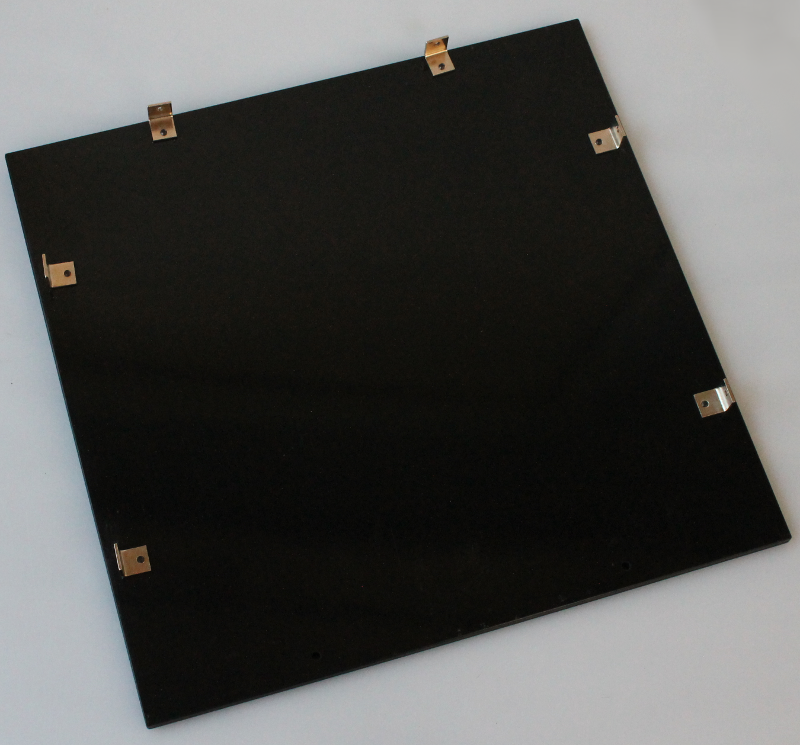

Step 4: Left and Back Panels
=====================================

Parts
----------

#. Left-side Panel
#. Back Panel
#. Hardware Bag 4

Assembly steps
-----------------

Left side panel: Mount 3 of the right-angle brackets as shown in the image below 
^^^^^^^^^^^^^^^^^^^^^^^^^^^^^^^^^^^^^^^^^^^^^^^^^^^^^^^^^^^^^^^^^^^^^^^^^^^^^^^^^^^^^^^^^^^^^^^^^^^

Make sure to leave the two holes free on the bottom edge free and two holes on the right side free.

Back panel: Mount 6 of the right-angle brackets as shown in the image below 
^^^^^^^^^^^^^^^^^^^^^^^^^^^^^^^^^^^^^^^^^^^^^^^^^^^^^^^^^^^^^^^^^^^^^^^^^^^^^^^^^^^^

Make sure to leave two holes free on the longer edge of the panel
