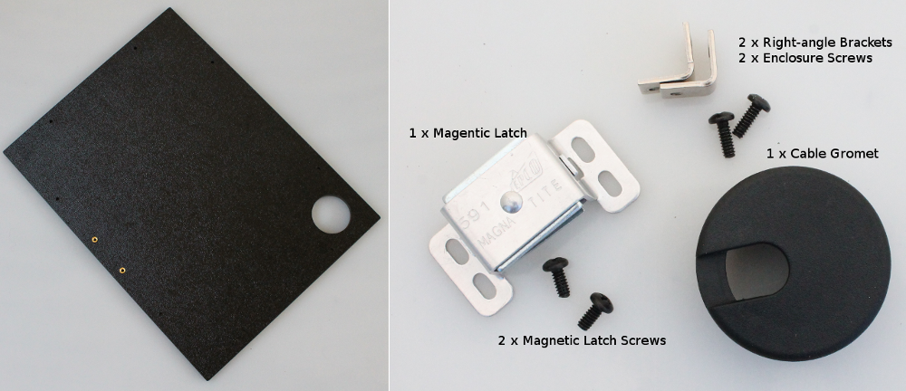
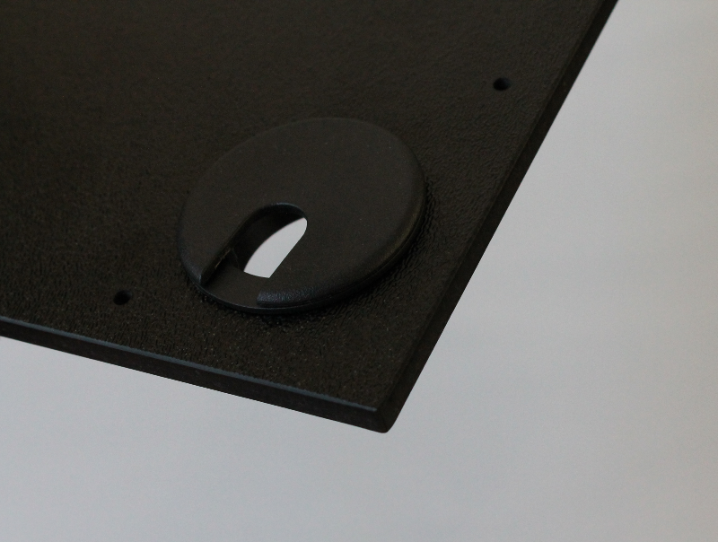

Step 3: Right Panel
=====================================

Parts
---------------

#. Right Panel
#. Hardware bag 3

Assembly steps
-----------------

Attach the magnetic latch to the inside of the right-side panel with the two screws
^^^^^^^^^^^^^^^^^^^^^^^^^^^^^^^^^^^^^^^^^^^^^^^^^^^^^^^^^^^^^^^^^^^^^^^^^^^^^^^^^^^^^^

.. figure:: _static/right_1.png
   :align:  center

Take the right-side panel, and mount 2 of the right-angle brackets as shown in the image below 
^^^^^^^^^^^^^^^^^^^^^^^^^^^^^^^^^^^^^^^^^^^^^^^^^^^^^^^^^^^^^^^^^^^^^^^^^^^^^^^^^^^^^^^^^^^^^^^^^^^

.. figure:: _static/right_2.png
   :align:  center
   
You should mount two on the top side. Make sure to leave the remaining four holes free   

Insert the cable entry grommet into the round hole at the bottom of the panel
^^^^^^^^^^^^^^^^^^^^^^^^^^^^^^^^^^^^^^^^^^^^^^^^^^^^^^^^^^^^^^^^^^^^^^^^^^^^^^^^^^^^^^

