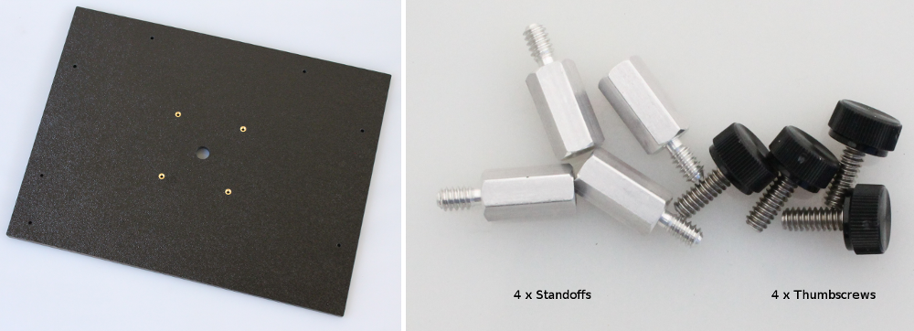
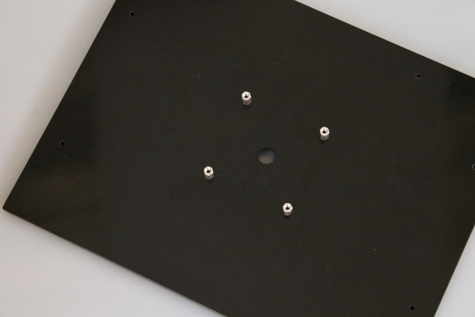
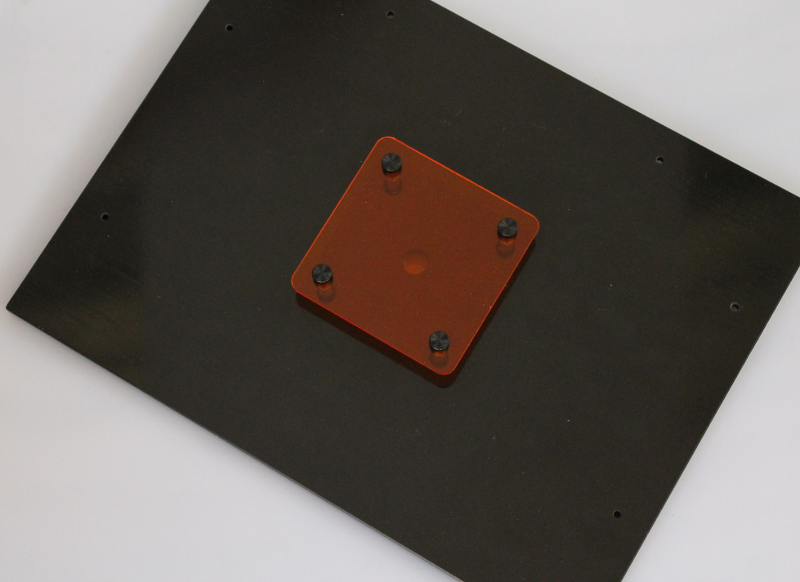
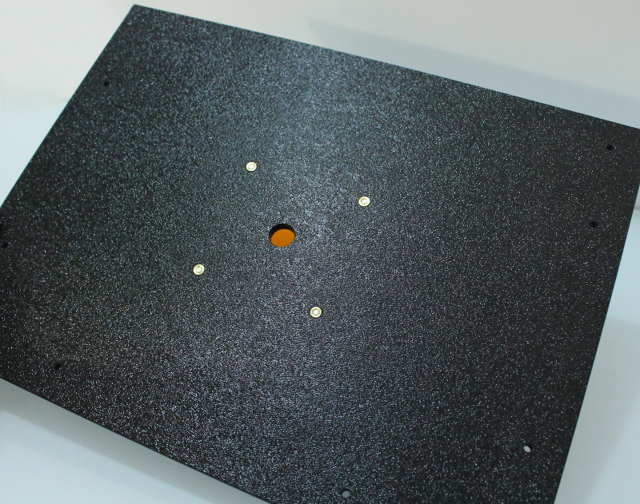

Step 5A: Smartphone Top Panel
=====================================

Parts
----------

#. Top Panel
#. Hardware Bag 5
#. Amber filter (not shown)

Assembly steps
-----------------

On the inside of the top panel mount the four filter standoffs as shown in the image below 
^^^^^^^^^^^^^^^^^^^^^^^^^^^^^^^^^^^^^^^^^^^^^^^^^^^^^^^^^^^^^^^^^^^^^^^^^^^^^^^^^^^^^^^^^^^^^^^

