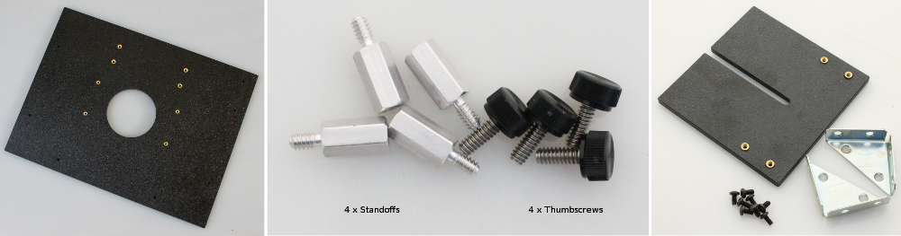
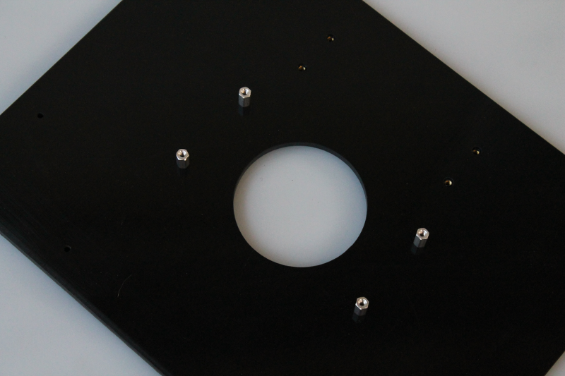
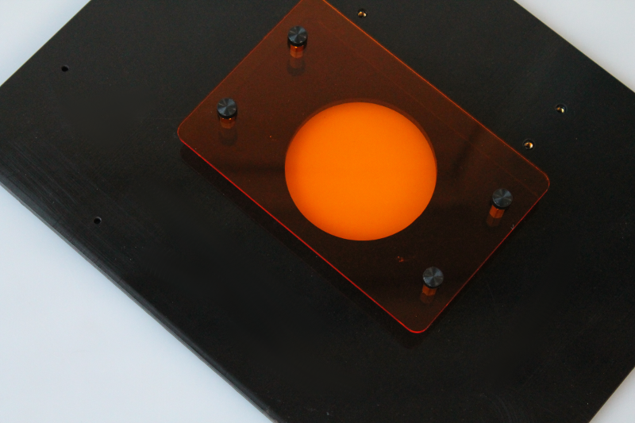
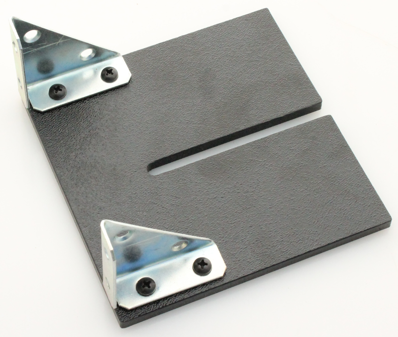
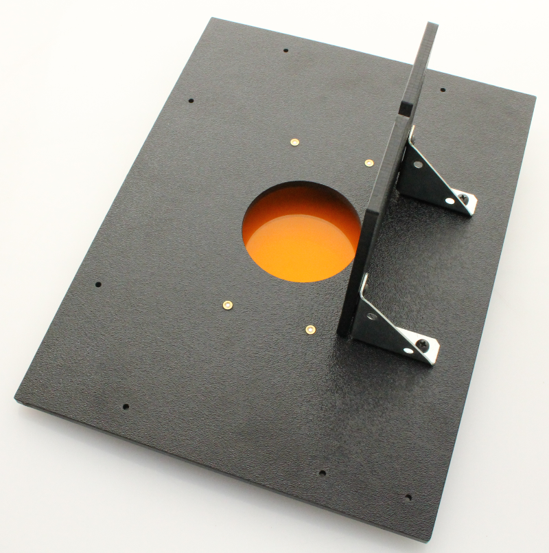

Step 5B: Camera Top Panel
=====================================

Parts
----------

#. Top Panel
#. Hardware Bag 5
#. Camera mount hardware

Assembly steps
-----------------

On the inside of the top panel mount the four filter standoffs as shown in the image below 
^^^^^^^^^^^^^^^^^^^^^^^^^^^^^^^^^^^^^^^^^^^^^^^^^^^^^^^^^^^^^^^^^^^^^^^^^^^^^^^^^^^^^^^^^^^^^^^

.. figure:: _static/top_3.png
   :align:  center

Next mount the brackets to the camera mount 
^^^^^^^^^^^^^^^^^^^^^^^^^^^^^^^^^^^^^^^^^^^^^^^^^^^^^

   
   
Any of these 
^^^^^^^^^^^^^^^^^

