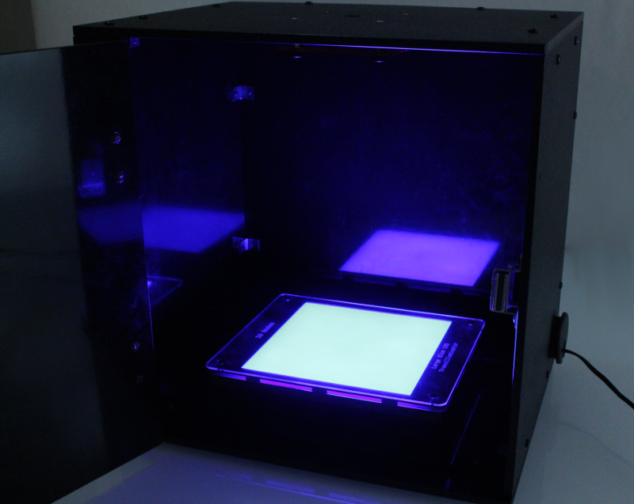
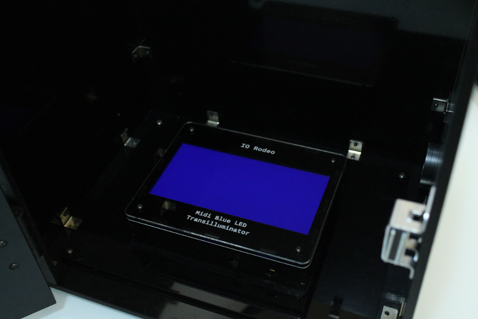
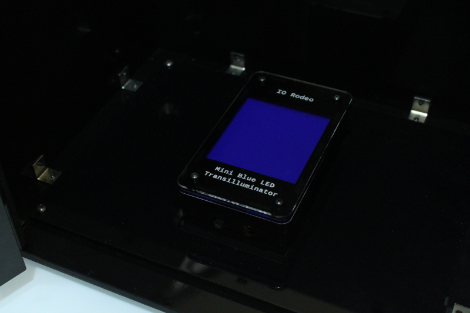

Installing blue LED transilluminator
========================================

Place the blue LED transilluminator into the enclosure. It will sit into the frame as shown in the image below (large transilluminator shown). 

   

.. figure:: _static/enclosure_large.png
   :align:  center

   
Feed the power supply plug through the hole/gromet in the right-hand side and plug into the transilluminator.    
   

   

Below are some images of the Midi and Mini LED transilluminators with their respective frames.

   
   
   